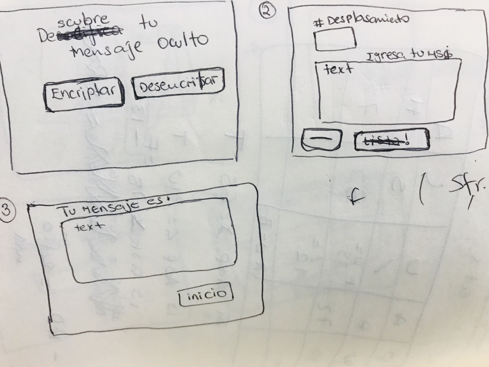
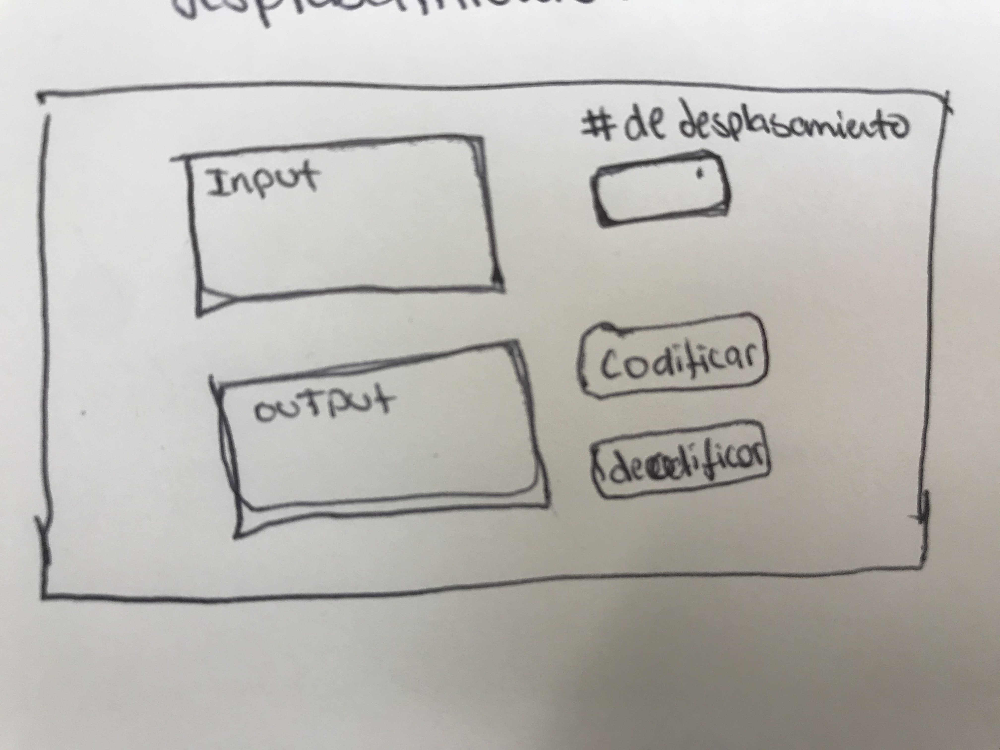

## 3. Objetivos de aprendizaje

El objetivo principal de aprendizaje es adquirir experiencia desarrollando
aplicaciones web (WebApp) que interactúen con el usuario a través del navegador
y la lógica, utilizando HTML, CSS y JavaScript como herramientas.

Reflexiona y luego marca los objetivos que has llegado a **entender** y
**aplicar** en tu proyecto.

### UX

* [ x ] [Diseñar la aplicación pensando y entendiendo al usuario]
(https://lms.laboratoria.la/cohorts/lim-2020-01-bc-core-lim012/courses/intro-ux/01-el-proceso-de-diseno/00-el-proceso-de-diseno)

* [ x ] [Crear prototipos para obtener feedback e iterar]
(https://lms.laboratoria.la/cohorts/lim-2020-01-bc-core-lim012/courses/product-design/00-sketching/00-sketching)

* [ x ] [Aplicar los principios de diseño visual]
(https://lms.laboratoria.la/cohorts/lim-2020-01-bc-core-lim012/courses/product-design/01-visual-design/01-visual-design-basics)

### HTML y CSS

* [ x ] [Uso correcto de HTML semántico]
(https://developer.mozilla.org/en-US/docs/Glossary/Semantics#Semantics_in_HTML)

* [ x ] [Uso de selectores de CSS]
(https://developer.mozilla.org/es/docs/Web/CSS/Selectores_CSS)

* [ x ] [Construir tu aplicación respetando el diseño realizado]
(https://lms.laboratoria.la/cohorts/lim-2020-01-bc-core-lim012/courses/css/01-css/02-boxmodel-and-display) (maquetación).

12/2/20
### DOM

* [ x ] [Uso de selectores de nodos del DOM]
(https://lms.laboratoria.la/cohorts/lim-2020-01-bc-core-lim012/courses/browser/02-dom/03-1-dom-methods-selection)

* [ x ] [Manejo de eventos del DOM]
(https://lms.laboratoria.la/cohorts/lim-2020-01-bc-core-lim012/courses/browser/02-dom/04-events)
Con los event listeners puedo declarar una inline funcion para realizar una accion en el button
* [ ] [Manipulación dinámica del DOM]
(https://developer.mozilla.org/es/docs/Referencia_DOM_de_Gecko/Introducci%C3%B3n)

### Javascript

* [ x ] [Manipulación de strings]
(https://lms.laboratoria.la/cohorts/lim-2020-01-bc-core-lim012/courses/javascript/06-strings/01-strings)
* [ x ] [Uso de condicionales]
(https://lms.laboratoria.la/cohorts/lim-2020-01-bc-core-lim012/courses/javascript/02-flow-control/01-conditionals-and-loops)
* [ ] [Uso de bucles]
(https://lms.laboratoria.la/cohorts/lim-2020-01-bc-core-lim012/courses/javascript/02-flow-control/02-loops)
* [ x ] [Uso de funciones]
(https://lms.laboratoria.la/cohorts/lim-2019-09-bc-core-lim011/courses/javascript/02-flow-control/03-functions)
* [ x ] [Datos atómicos y estructurados]
(https://www.todojs.com/tipos-datos-javascript-es6/)
* [ x ] Utilizar ES Modules (`import` | `export`).

### Testing

* [ x ] [Testeo de tus funciones]
(https://jestjs.io/docs/es-ES/getting-started)

### Git y GitHub

* [ x ] [Comandos de git]
(https://lms.laboratoria.la/cohorts/lim-2019-09-bc-core-lim011/courses/scm/01-git/04-commands)
  (`add` | `commit` | `pull` | `status` | `push`).
* [ x ] [Manejo de repositorios de GitHub]
(https://lms.laboratoria.la/cohorts/lim-2019-09-bc-core-lim011/courses/scm/02-github/01-github)  (`clone` | `fork` | `gh-pages`).

'Bienvenido a cifrando'

* Imagen final de tu proyecto:

previous:

* Investigación UX:
  1. Descripcion de los usuarios y objetivos en relación con el
    producto.

    Bienvendo a cifrando esta dirigido a los usuarios que buscan encriptar y/o desencriptar palabras. Un usuario, quiere registrarse en la plataforma digital de su banco. Al registrarse el usuario es requerido de ingresar una contraseña, esta debe cumplir con especificos parametros de seguridad. El usuario se enfrenta a un problema. No se siente seguro si va a recordar su contraseña. Bienvenido a cifrando resolverá su problema encriptando la palabra que ellos puedan recordar fácilmente. La pagina web cifrando requiere ingresar una palabra y asignar un número de desplazamiento, el mismo que luego les ayudará a descifrar la misma palabra.
    En conclusion, El objetivo principal del siguiente proyecto se basa en encriptar y desencriptar oraciones ingresadas por el usuario.

  2. Explicar cómo el producto soluciona los problemas/necesidades de dichos
    usuarios.
    Este producto tiene como objetivo resolver la confusión del usuario al desarrollar contraseñas personales.

  4. Feedback recibido indicando las mejoras a realizar: para definis mi usuario tuve que ser mas especifica al explicas el problema que mi usuario presencia y como mi pagina iba a resolverlo.
  Primer prototipado:
  
  Recibi el feedback de mis compañeras que deberia hacer mi interfaz mas simple. me comentaron que deberia poner las textboxes en una sola pagina. Fue asi que modifique mi primer sketch.
  Segundo sketch:
  
  Imagen del prototipo final:s
    
